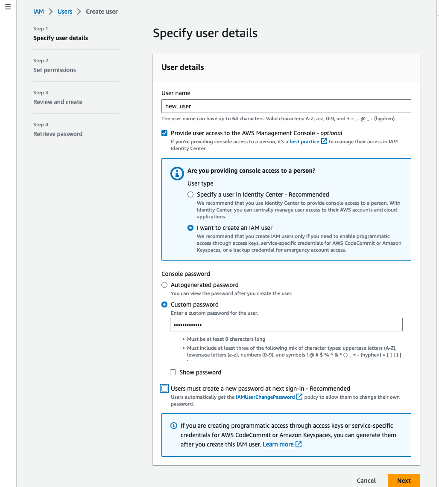
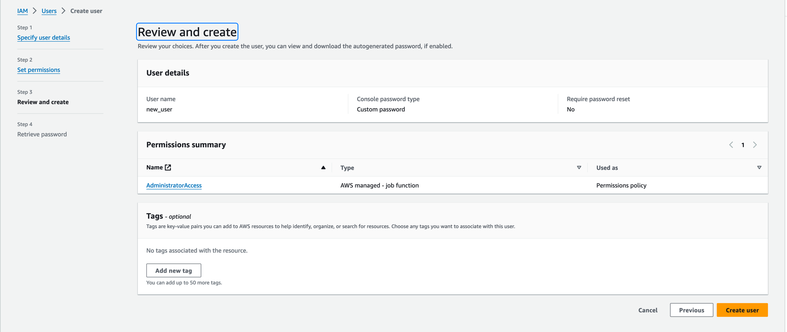
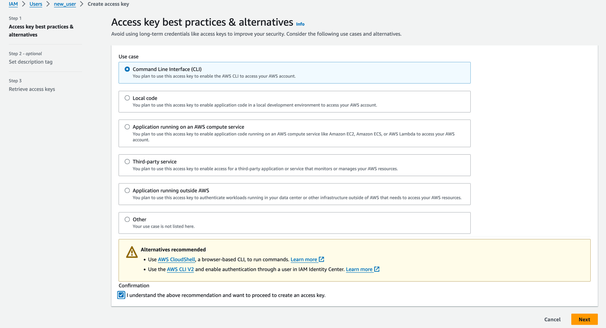

# Data Engineering Workshop
## Prerequisites
### GitHub Desktop
1. Download GitHub Desktop: https://desktop.github.com/
2. Install it.
3. Login to your GitHub account.
4. Clone this repository.
5. Open the repository in your IDE.
6. Create a new branch as "dev/<YOUR_NAME>", for example: "dev/danylo".
7. Make some very small change in the README.md file.
8. Make sure that you are on the branch that you created.
9. Commit and push the changes to the remote repository.

---

### Python
1. Install Python 3.9^: https://www.python.org/downloads/
2. Create a virtual environment: ```python -m venv venv```
3. Activate the virtual environment:
   - Linux/MacOS: ```source venv/bin/activate```
   - Windows: ```.\venv\Scripts\activate```
4. Install requirements: ```pip install -r requirements.txt```

**For windows users it might be required to add Python to PATH manually. https://realpython.com/add-python-to-path/**

---

### AWS CLI
#### Installation
1. Download installer:
   - Windows: https://awscli.amazonaws.com/AWSCLIV2.msi
   - MacOS: https://awscli.amazonaws.com/AWSCLIV2.pkg
   - Linux: https://docs.aws.amazon.com/cli/latest/userguide/install-cliv2-linux.html#cliv2-linux-install
2. Install it. (Note in some cases it will require to add it to PATH manually)
3. Check if the installation was successful: ```aws --version```

---

#### Configuration
1. Go to AWS Console -> IAM -> Users 
2. If you don't have a user in Users tab, create it.
   - Step 1: 
   - Step 2: Add permissions to the user: 
   - Step 3: 
3. Click on the user and go to the Security credentials tab.
4. Use "Ctrl + F" to find "Access keys" section.
5. Click on "Create access key" button:
   - Step 1: Choose CLI 
   - Step 2: You can skip tag creation, just hit "Create access key"
   - Step 3: Download .csv file with credentials and save it in a safe place, cause you will not be able to download it again.
6. Open terminal and run ```aws configure```
7. After this command you will be asked to provide:
   - AWS Access Key ID (Access key ID from the .csv file)
   - AWS Secret Access Key (Secret access key from the .csv file)
   - Default region name (us-east-1) 
   - Default output format (Just hit enter to skip it)
8. Check if the configuration was successful: ```aws s3 ls```
9. If you see the list of buckets, then everything is fine.

---

### Terraform
1. Download Terraform: https://developer.hashicorp.com/terraform/install
   - Windows: 
     - If you have 32bit processor: Choose 386 version
     - If you have 64bit processor: Choose AMD64 version
   - MacOS:
     - Using brew:
       ``` shell
          brew tap hashicorp/tap
          brew install hashicorp/tap/terraform
       ```
     - Using package manager:
       - If you have Mac with M1^ chip: Choose ARM64 version
       - If you have Mac with Intel chip: Choose AMD64 version
   - Linux:
     - If you're using package manager: 
       - Choose your distribution from the menu and paste the commands that are shown on the page.
     - Using binary installer:
       - If you have 32bit processor: Choose 386 version
       - If you have 64bit processor: Choose AMD64 version
2. Check if the installation was successful: ```terraform --version```

**Note: For Windows users it might be required to add Terraform to PATH manually**

---
### To build the infrastructure run:
```terraform
   terraform init
   terraform plan -out plan.out
   terraform apply plan.out
```

### If you want to use pre-commits
Pre-commit is a tool that will run some checks before you commit your code. I add the config in .pre-commit-config.yaml file.
#### It will run:
1. pyupgrade - A tool (and pre-commit hook) to automatically upgrade syntax for newer versions of the language.
2. black - Python code formatter.
3. ruff - Also a code formatter.

#### To use it:
1. Install: ```pip install pre-commit```
2. Run      ```pre-commit run --all-files```

